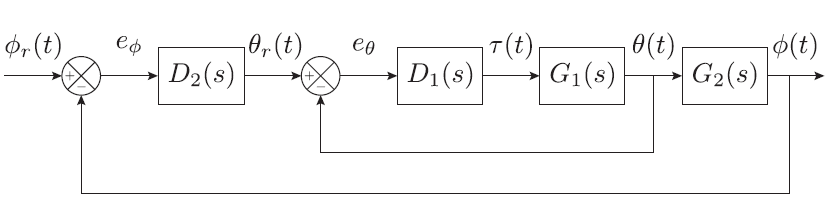

# Mobile Inverted Pendulum System

A project for ROB 550: Robotics Systems Lab course taught in University of Michigan, Ann Arbor. An overview of this project:
##### Acting
- Dynamic control of DC motors to balance and control a wheeled inverted pendulum
- Trajectory Following for a mobile robot

##### Sensing 
- Use of wheel encoders for performing odometry
- Use of MEMS IMU sensors to determine orientation (heading, pitch angle)

##### Design
- Build a system from the ground up based on an embedded system
- Use of Beaglebone with Robot Control Library in C for soft real-time control

The control architecture can be explained by the following figure: 

### Dependencies
#### libroboticscape
Source code for The Robot Control Library is in the folder `~/Install/librobotcontrol`. Check out the [website](http://strawsondesign.com/docs/librobotcontrol/index.html), or the [github repository](https://github.com/StrawsonDesign/librobotcontrol) for how to use the functionality it provides.

### Running the code
- run `test_motors.c` to test the motor standalone
- `balancebot/balancebot.c` is the main code which starts two threads, and attaches the `balancebot_controller()` function to the IMU interrupt.

### Directories and Codebase 

| Files                             | Description   |
| -------------                     | -------------  |
| `bin/`                            | Binaries folder  |
| `balanceebot/balanceebot.c/.h`    | Main setup and threads |
| `test_motors/test_motors.c/.h`    | Program to test motor implementation|
| `common/mb_controller.c/.h `      | Contoller for manual and autonomous nav |
| `common/mb_defs.h  `              | Define hardware config|
| `common/mb_motors.c/.h  `         | Motor functions to be used by balancebot|
| `common/mb_odometry.c/.h	`       | Odometry functions|
| `optitrack/`                      | optitrack driver/server|
| `xbee_serial`                     | xbee serial optitrack client code|

### Square Lap corrected by UMBark procedure

Check out the [final report](https://github.com/saptadeb/balanceBot/blob/master/05-balancebot-w20.pdf) for more information and results.

### Collaborators
[Shreyas Bhat](https://www.linkedin.com/in/shreyas-bhat-42a07410a/) and [Saptadeep Debnath](https://www.linkedin.com/in/saptadeep-deb/)

